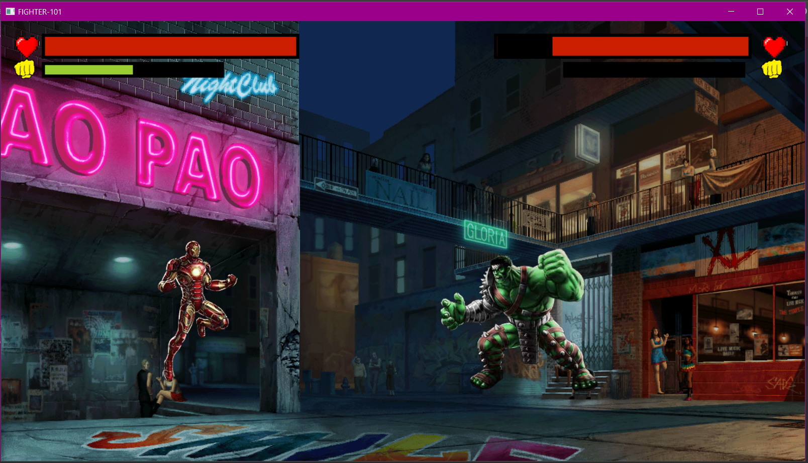
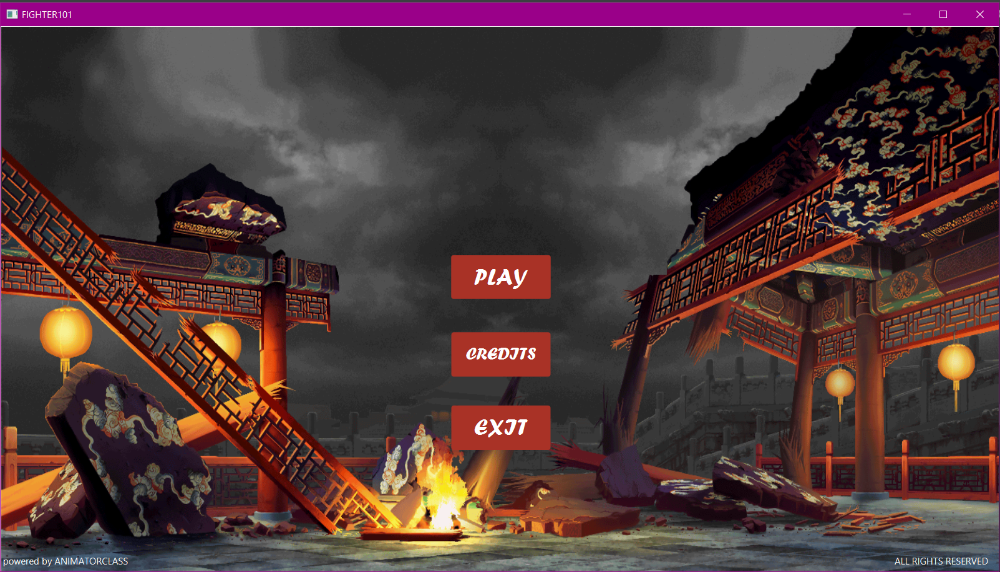
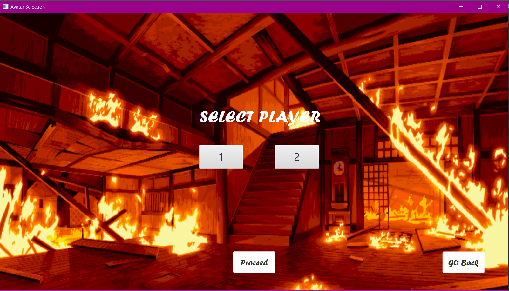
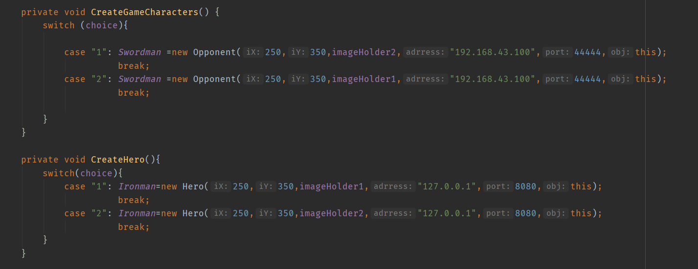

# JAVAFX_FIGHTING_GAME
This is the project done for OOP course. This is a fighting game written from scratch using java-FX SDK.
No external library was used for the game engine, rather builtin animation of javafx was used to create the game engine.
The game has all the required assets in the project folder.

In order to run the game, java-FX SDK needs to be used. Here is the [link](https://stackoverflow.com/questions/53668630/how-to-run-javafx-applications-in-intellij-idea-ide) to configure java-fx with Intellij-IDE, as that was the IDE we used to develop this project. Incase of java-FX SDK, you can download the SDK for operating system of your choice from this [link](https://gluonhq.com/products/javafx/).

Here are some screenshots of the gamein action

## Important Point
The game has multiplayer support, that was implemented from scratch with java sockets and threads. However the multiplayer system will only work between two computers.
There is no option to choose the ip address on the GUI. So in order to run this game, the specific ip address of two computers is to be set in the Main.java file's two function 
namely CreateGameCharacters() and CreateHero().

Here is where the change needs to be made:

Just place the **IP addresses** in the correct places of the two connected computers on the LAN.

With all set, the game is good to go. Enjoy!!!
